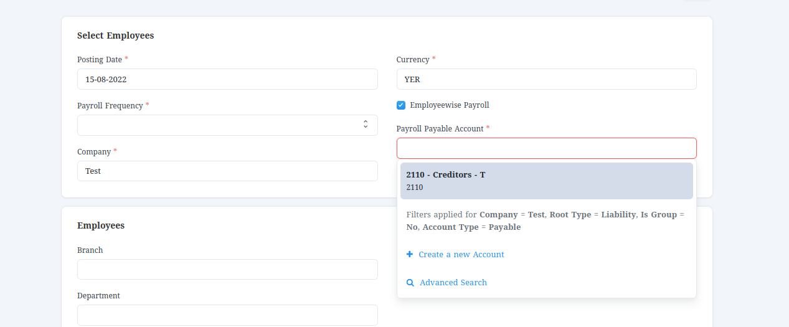
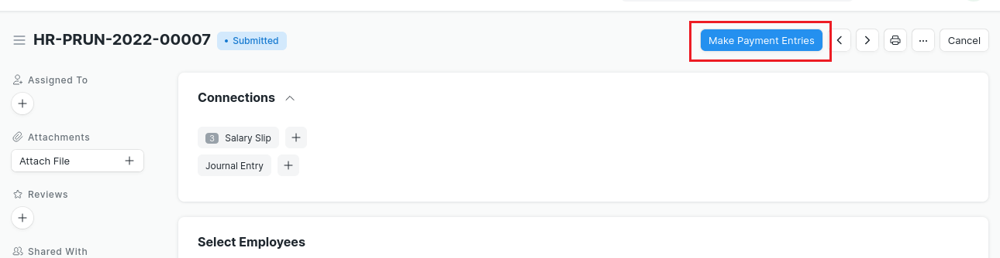
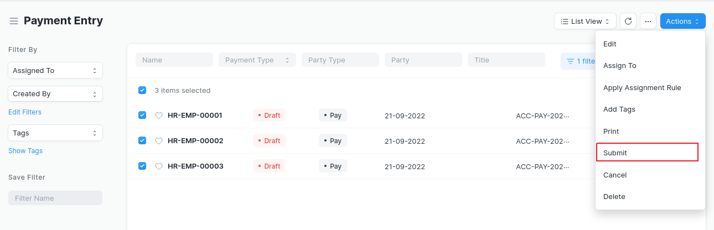

# Employeewise Payroll

Make employee-wise Journal Entry for payroll entry

Customize payroll to record each employee Liability and pay them in cash instead of paying them through bank.


**Employeewise Payroll** is an application built on **frappe** framework and use **ERPNext** features.

## Features:
* option in [Payroll Entry](https://docs.erpnext.com/docs/v13/user/manual/en/human-resources/payroll-entry) to detect if it's employee-wise.
* if payroll entry is employee-wise then
    1. filter Payroll Payable Account to [payable account type](https://docs.erpnext.com/docs/v13/user/manual/en/accounts/chart-of-accounts#24-other-account-types).
    2. on submitting salary slips form Payroll Entry create one `Journal Entry` that sum the **debit (*Earning*)** and **credit (*Deduction*)** for each [`Salary Component`](https://docs.erpnext.com/docs/v13/user/manual/en/human-resources/salary-component) **(Default Behavior)** and distinguish employees' Liability  for each Salary Slip and set employee as party.
    3. after submitting salary slips add button in Payroll Entry to create [`Payment Entry`](https://docs.erpnext.com/docs/v13/user/manual/en/accounts/payment-entry) For each salary slip and add created `Journal Entry` in [Payment References table](https://docs.erpnext.com/docs/v13/user/manual/en/accounts/payment-entry#payment-references-table).

## Installation.
#### 1. Dependencies
1. Frappe (version-13) (tested on _v13.37.1_).
1. ERPNext (version-13) (tested on _v13.36.3_).

#### 2. Installation.

  ```sh
  bench get-app https://github.com/open-alt/employeewise_payroll.git
  ```

  ```sh
  bench --site <site_name> install-app employeewise_payroll
  ```

## Use
Use it in `Payroll Entry` by

1. Check `Payroll Entry` As `Employeewise Payroll`


2. Select **payable** `Account` for `Payroll Payable Account` field


3. Then Get **Employees** And Create `Salary Slip`s

4. Submit `Salary Slip`s from Payroll Entry, this also will Create `Journal Entry` record each Employee **Liability**

5. To Pay Salaries, Click `Make Payment Entries`, this will create `Payment Entry` for each `Employee`.


6. Click `Payment Entries` to view **payments** for this **payroll**.


7. Then Submit **Payment Entries** for each **Employee**
> (it's possible to select all **payments** and submit them).
> 


> ***Hint:***
>
> if some employees have **payments**, and some others have **cancelled** or **no** `Payment Entry`,
>
> *then* `Make Payment Entries` will only make **payments** for **these** who have **cancelled** or no `Payment Entry`

#### License

GNU General Public License (v3+)
